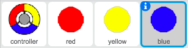

--- challenge ---
## التحدي: المزيد من النقاط
كرِّر كائن النقطة 'الأحمر' مرتين، ثم سمِّ الكائنين الجديدين 'أصفر' و'أزرق'.

قم بتحرير هذه الكائنات (بما في ذلك التعليمات البرمجية الخاصة بها)، بحيث تتطابق كل نقطة ملوَّنة مع جزء القرص الدوَّار المطابق لها في اللون. تذكَّر أن تختبر مشروعك، وتأكد من أنك تكسب النقاط أو تخسر المحاولات وفقًا للتعليمات البرمجية التي أدخلتها، وأن لعبتك ليست سهلة جدًا أو صعبة للغاية!

--- /challenge ---