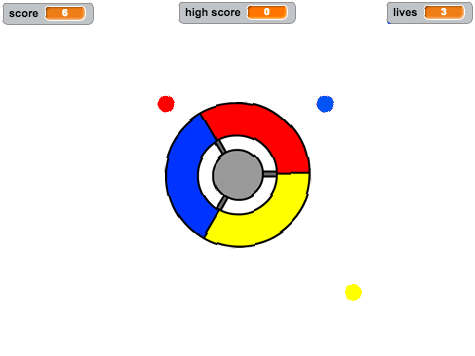

--- no-print ---

This is the **Scratch 2** version of the project. There is also a [Scratch 3 version of the project](https://projects.raspberrypi.org/cy-GB/projects/catch-the-dots).

--- /no-print ---

## Cyflwyniad

Yn y prosiect yma fe fyddi di'n dysgu sut i greu gêm, lle mae angen i ti sicrhau fod lliwiau'r dotiau yn cyd-fynd gyda darn cywir y rheolwr.

  <iframe allowtransparency="true" width="485" height="402" src="https://scratch.mit.edu/projects/embed/44942820/?autostart=false" frameborder="0"></iframe>
  

--- collapse ---
---
title: Nodiadau i Wirfoddolwyr
---

## Adnoddau
Ar gyfer y prosiect yma, dylid defnyddio Scratch 2.  Mae modd defnyddio Scratch 2 arlein yma [jumpto.cc/scratch-on](http://jumpto.cc/scratch-on) neu mae modd ei lawrlwytho yma [jumpto.cc/scratch-off](http://jumpto.cc/scratch-off) a'i ddefnyddio heb gysylltiad gwe.

Mae'r ddolen 'Adnoddau'r Prosiect' yn cynnwys yr adnoddau canlynol:

## Adnoddau Gwirfoddolwyr

Mae modd gweld y prosiect wedi ei gwblhau yma <a href="http://scratch.mit.edu/projects/44942820/#editor">online</a>, neu mae modd ei lawrlwytho wrth glicio ar ddolen 'Adnoddau'r Prosiect' ar gyfer y prosiect yma, sydd yn cynnwys:

+ CatchTheDots.sb2

## Adnoddau'r Prosiect

Ar gyfer y prosiect yma, bydd aelodau'r clwb yn gallu defnyddio adnoddau allanol nad ydynt ar gael yn llyfrgell Scratch:

+ controller.svg.

Gwnewch yn siwr fod gan bod plentyn fynediad i'r adnoddau yma.

Ar gyfer aelodau'r clwb nad ydynt yn gallu cael mynediad i adnoddau'r prosiect, mae yna brosiect Scratch gyda'r adnoddau allanol ynddynt yn barod. Mae ar gael arlein [jumpto.cc/dots-resources](http://jumpto.cc/dots-resources), neu yn yr adnoddau prosiect i'w lawrlwytho, sydd yn cynnwys:

+ CatchTheDotsResources.sb2 

## Nodau Dysgu
+ Mae'r prosiect yma yn atgyfnerthu y sgiliau rhaglenni sydd wedi eu dysgu hyd yn hyn.

Mae'r prosiect yma yn trin elfennau sydd yn rhan o'r adran ganlynol o [Faes Llafur Gwneud Digidol Raspberry Pi](http://rpf.io/curriculum):

+ [Cyfuno adeiladwaith rhaglenni i ddatrys problem.](https://www.raspberrypi.org/curriculum/programming/builder)

## Heriau
+ "Troi i'r chwith" - creu côd i symud y rheolwr;
+ "Mwy o ddotiau" - creu mwy o ddotiau lliw sydd angen cyd-fynd â rhannau o'r rheolwr; 
+ "Dotiau yn symud yn gynt" - defnyddio newidyn i gynyddu cyflymder y dotiau trwy gydol y gêm; 
+ "Gwella dy gêm!" - ychwanegu dotiau newydd sydd yn effeithio'r newidyn `sgôr`{:class="blockdata"}, `oedi`{:class="blockdata"} a `cyflymder`{:class="blockdata"}; 
+ "Dewislen gêm" - creu dewislen gyda chefndiroedd amrywiol a botymau i symud rhyngddynt. 

--- /collapse ---
