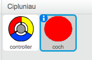
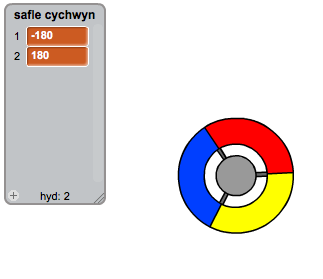

## Casglu dotiau

Fe wnawn ni ychwanegu dotiau i'r chwareuwr eu casglu gyda'r rheolwr.

+ Bydd angen creu ciplun newydd o'r enw 'coch'.  Fe ddylai'r ciplun yma fod yn ddot bach coch.

	

+ Ychwanega'r sgript yma i dy giplun dot 'coch', i greu clôn bob ychydig o eiliadau:

	```blocks
		pan fo ⚑ wedi ei glicio
			cuddio
			aros (2) eiliad
			am byth
   		creu clôn o [fi fy hun v]
   		aros (dewis ar hap (5) i (10)) eiliad
			end
	```

+ Pan mae pob clôn yn cael ei greu, rwyt ti eisiau iddo ymddangos yn un o 4 cornel y llwyfan.

	

	I wneud hyn, bydd angen yn gyntaf creu __rhestr__ o'r enw `safle cychwyn`{:class="blockdata"} a chlicio'r `(+)` i ychwanegu `-180` a `180`.

	

+ Fe alli di ddefnyddio'r 2 eitem o'r rhestr yma i ddewis corneli ar hap o'r llwyfan. Ychwanega'r côd yma i'r ciplun 'dot', fel bod pob clôn newydd yn symud i gornel ar hap ac yna'n symud yn araf tuag at y rheolwr.

	```blocks
		pan dechreuaf fel clôn
			mynd i x:(eitem (ar hap v) o [safle cychwyn v]) y:(eitem (ar hap v) o [safle cychwyn v])
			pwyntio tuag at [controller v]
		dangos
			ailwna hyd at <cyffwrdd [controller v]?>
   		symud (1) cam
		end
	```

	Mae'r côd uchod unai yn dewis '-180' neu '180' ar gyfer safle yr x _a_ y, sy'n golygu bod pob clôn yn cychwyn yn un cornel o'r llwyfan.

+ Profa dy gêm.  Fe ddyle ti weld llawer o ddotiau coch yn ymddangos ymhob cornel o'r sgrin, ac yn symud yn araf tuag at y rheolwr.

	

+ Bydd angen creu 2 newidyn newydd o'r enw `bywydau`{:class="blockdata"} a `sgôr`{:class="blockdata"}.

+ Ychwanega côd i dy lwyfan i osod `bywydau`{:class="blockdata"} i 3 a'r `sgôr`{:class="blockdata"} i 0 ar ddechrau'r gêm.

+ Bydd angen i ti ychwanegu côd i ddeiwedd côd dy ddot coch `pan dechreuaf fel clôn`{:class="blockcontrol"}, fel bod unai 1 yn cael ei ychwanegu i `sgôr`{:class="blockdata"} y chwareuwr os yw'r lliwiau'n cyd-fynd, neu 1 yn cael ei gymryd i ffwrdd o `fywydau`{:class="blockdata"} y chwareuwr os nad yw'r lliwiau yn cyd-fynd.

	```blocks
		symud (5) cam
			os <cyffwrdd lliw [#FF0000]?> wedyn
   		newid [sgôr v] gan (1)
   		chwarae sain [pop v]
		fel arall
  			 newid [bywydau v] gan (-1)
  			chwarae sain [laser1 v]
		end
		dileu y clôn hwn
	```

+ Ychwanega'r côd yma i ddiwedd sgript dy lwyfan, fel bod y gêm yn dod i ben pan mae'r chwareuwr yn colli y bywydau i gyd:

	```blocks
		aros hyd at <(bywydau) < [1]>
		stopiwch [y cyfan v]
	```

+ Profa dy gêm i wneud yn siwr fod y côd yn gweithio fel oeddet ti'n disgwyl.
