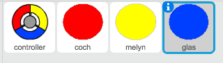
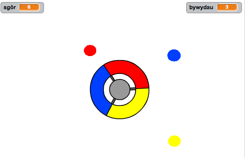

--- challenge ---
## Her: Mwy o ddotiau 
Dyblyga'r ciplun dot 'coch' ddwywaith, a galwa'r cipluniau newydd yn 'melyn' a 'glas'.

Golyga'r cipluniau yma (yn cynnwys eu côd), fel bod pob dot lliw yn gorfod cyd-fynd â'r lliw cywir ar y rheolwr.  Cofia brofi dy brosiect, gan wneud yn siwr dy fod yn ennill pwyntiau a cholli bywydau ar yr adegau cywir, a bod dy gêm ddim yn rhy hawdd nac yn rhy galed!

--- /challenge ---