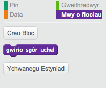
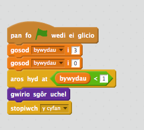

## Sgôr uchel

Nesaf, rydym am arbed y sgôr uchel fel bod y chwareuwyr yn gwybod pa mor dda maent yn ei wneud.

+ Bydd angen creu newidyn newydd o'r enw `sgôr uchel`{:class="blockdata"}.

+ Clicia ar dy lwyfan, a chreu bloc newydd o'r enw `gwirio sgôr uchel`{:class="blockmoreblocks"}.

	

+ Cyn diwedd dy gêm, ychwanega'r bloc newydd yma.

	

+ Ychwanega côd i dy floc newydd i arbed y `sgôr`{:class="blockdata"} cyfredol fel `sgôr uchel`{:class="blockdata"} `os`{:class="blockcontrol"} mai dyma'r sgôr uchaf hyd yn hyn:

	```blocks
		diffinio [gwirio sgôr uchel]
			os <(sgôr) > (sgôr uchel)> wedyn
   			gosod [sgôr uchel v] i (sgôr)
		end
	```

+ Profa'r côd rwyt ti wedi ei ychwanegu.  Chwarae dy gêm i weld os yw dy `sgôr uchel`{:class="blockdata"} wedi ei ddiweddaru'n gywir.


