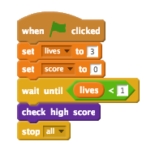

## Hohe Punktzahl

Lass uns die hohe Punktzahl speichern, damit der Spieler sehen kann, wie gut sein Fortschritt ist.

+ Erstelle eine neue Variable namens `high score`{:class="blockdata"} (hohe Punktzahl).

+ Klicke auf dein Stadium und erstelle einen neuen, speziell angefertigten Block namens `check high score`{:class="blockmoreblocks"} (hohe Punktzahl prüfen).

	

+ Füge deinen neuen, speziell angefertigten Block kurz vor Spielende hinzu.

	

+ Füge den Code zu deinem speziell angefertigten Block hinzu, um die aktuelle `score`{:class="blockdata"}  (Punktzahl) als `high score`{:class="blockdata"} (hohe Punktzahl) zu speichern`if`{:class="blockcontrol"} (wenn) sie bis dahin die höchste Punktzahl ist:

	```blocks
		Definiere [object Object]
		falls <(score) > (high score)> dann
   			setze [high score v] auf (score)
		Ende
	```

+ Teste den Code, den du hinzugefügt hast. Spiele dein Spiel, um zu prüfen, ob die `high score`{:class="blockdata"} (hohe Punktzahl) korrekt aktualisiert wurde.


