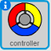
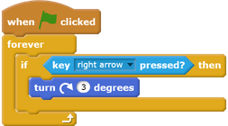
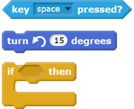
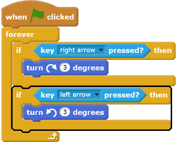

## Create a controller

Start by creating a controller that the player will use to collect dots.

--- task ---
Open the 'Catch the dots' Scratch starter project from [rpf.io/p/en/catch-the-dots-scratch2-go](http://rpf.io/p/en/catch-the-dots-scratch2-go), and then open it in the Scratch offline editor.

If you need to download and install the Scratch offline editor, you can find it at [rpf.io/scratchoff](http://rpf.io/scratchoff).

--- /task ---

You should see a controller sprite:

--- task ---
Add some code to the controller sprite to make the sprite turn right if the player presses the right arrow key:

--- /task ---

--- task ---
Test your code. The controller should spin to the right when you press the right arrow key.
--- /task ---

--- task ---
Add code to the controller sprite to make the sprite turn left if the player presses the left arrow key.

--- hints ---
--- hint ---

Find the code that checks whether the right arrow key is pressed and makes the sprite turn right. Can you add a copy of this code, and change the copy so it checks whether the left arrow key is pressed and makes the sprite turn left?

--- /hint ---
--- hint ---
Here are the blocks you need:

--- /hint ---
--- hint ---
Here is what your code should look like:

--- /hint ---
--- /hints ---
--- /task ---
