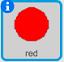
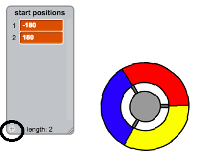
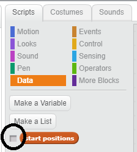
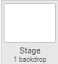

## Gain points or lose lives

Now you're going to add some dots that the player needs to collect.

--- task ---
Create a new sprite called 'red'. This sprite should be a small red dot.


--- /task ---

--- task ---
Add this script to your 'red' sprite to create a new clone of the sprite every few seconds:



```blocks
	when flag clicked
	hide
	wait (2) secs
	forever
		create clone of [myself v]
		wait (pick random (5) to (10)) secs
	end
```
--- /task ---

If you click the green flag now, it looks like nothing is happening. This is because all of the cloned sprites are hidden, and they appear in the same place.

You are going to add code to make each new clone appear in one of the four corners of the Stage.


--- task ---
Create a new list called `start positions`{:class="blockdata"}, click the list's `(+)` icon to add the values `-180`{:class="blockdata"}  and `180`{:class="blockdata"}.




[[[generic-scratch-make-list]]]

Then you can hide the list by unselecting this box:


--- /task ---

Notice that the coordinate for each corner of the Stage is a combination of `180` and `-180`. This means you can use the list to pick a corner of the Stage at random.

--- task ---
Add this code to the 'dot' sprite to make each new sprite clone appear in a random corner and then slowly move towards the controller sprite.


```blocks
	when I start as a clone
	go to x: (item (random v) of [start positions v]) y: (item (random v) of [start positions v])
	point towards [controller v]
	show
	repeat until <touching [controller v]?>
		move (1) steps
	end
```

--- /task ---
This new code chooses either `-180` or `180` for the x and y positions, meaning that each 'dot' sprite clone starts in a corner of the Stage.

--- task ---
Test your project. You should see red dots appear in the corners of the Stage and move slowly towards the controller.


--- /task ---

--- task ---
Create two new variables called `lives`{:class="blockdata"} and `score`{:class="blockdata"}.


--- /task ---

--- task ---
Add code to your Stage to set the `lives`{:class="blockdata"} variable to `3` and the `score`{:class="blockdata"} to `0` at the start of the game.


```blocks
when flag clicked
set [lives v] to (3)
set [score v] to (0)
```
--- /task ---

--- task ---
Add this code to the end of the Stage's script to make the game end when the player loses the last of the lives:


```blocks
	wait until <(lives) < [1]>
	stop [all v]
```
--- /task ---

The player should win points for catching dots, and should lose lives for failing to catch dots. A dot can only be caught by matching the colour of the controller to the colour of the dot.

--- task ---
Go back to the 'red' dot sprite's Scripts area to add some code blocks to the end of the sprite's `when I start as a clone`{:class="blockcontrol"} script.

First, make the dot clone `move 5 steps`{:class="blockmotion"} so that it overlaps the controller.

Then add code to either add `1` to `score`{:class="blockdata"} if the colour of the dot clone matches the colour of the controller when they touch, or to take `1` away from `lives`{:class="blockdata"} if their colours don't match.


```blocks
	move (5) steps
	if <touching color [#FF0000]?> then
		change [score v] by (1)
		play sound [pop v]
	else
		change [lives v] by (-1)
		play sound [laser1 v]
	end
	delete this clone
```
--- /task ---

--- task ---

Test your game to make sure that you lose a life if you don't match a dot with the correct colour, and that you score a point if you match a dot correctly.

--- /task ---
