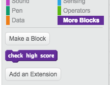

## High score

You're going to save the game's high score, so that players can see how well they are doing.

--- task ---
Create a new variable called `high score`{:class="blockdata"}.

--- /task ---

--- task ---
Select the Stage, and create a new custom block called `check high score`{:class="blockmoreblocks"}.

--- /task ---

--- task ---
Add code to your custom block so that the block checks if the current value of `score`{:class="blockdata"} in larger than the value of the `high score`{:class="blockdata"} variable, and then stores the value of `score`{:class="blockdata"} as the new value of `high score`{:class="blockdata"}.

--- /task ---

--- task ---
Add your new custom block to the Stage script before the end of the script.

--- /task ---

--- task ---

Play your game twice to check whether your score gets correctly saved as the `high score`{:class="blockdata"}.

--- /task ---
