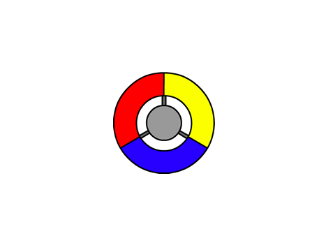

## Crear un controlador

Empezaremos por crear un controlador, que usaremos para recoger los puntos.

+ Empieza un nuevo proyecto de Scratch, y elimina el objeto gato para que el proyecto esté vacío. Puedes encontrar el editor en línea de Scratch en <a href="http://jumpto.cc/scratch-new">jumpto.cc/scratch-new</a>.

+ Si el líder de tu club te ha dado una carpeta de 'Recursos', haz clic en 'Cargar objeto desde archivo' y añade la imagen 'controller.svg'. Tendrás que mover el objeto al centro del escenario.

	

	Si no tienes esta imagen, ¡puedes dibujarla tú!

+ Haz que el controlador gire hacia la derecha cuando presiones la tecla de flecha derecha:

	```blocks
		al presionar bandera verde
		por siempre
   			si <¿tecla [flecha derecha v] presionada?> entonces
      			girar a la izquierda (3) grados
   			fin
		fin
	```
+ Prueba tu controlador. Debería girar hacia la derecha.


