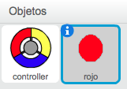
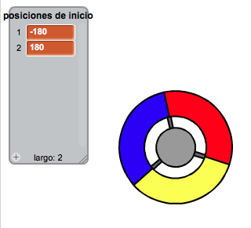

## Recoger puntos

Vamos a añadir algunos puntos que el jugador tendrá que recoger con el controlador.

+ Crea un nuevo objeto llamado 'rojo'. Este objeto debería ser un pequeño punto rojo.

	

+ Añade estas instrucciones al objeto punto 'rojo', para que se cree un nuevo clon del punto cada determinados segundos:

	```blocks
		al presionar bandera verde
		esperar (2) segundos
		por siempre
   			crear clon de [mí mismo v]
   			esperar (número al azar entre (5) y (10)) segundos
		fin
	```

+ Cuando se crea un clon, queremos que aparezca en una de las 4 esquinas del escenario.

	

	Para hacer esto, primero tendrás que crear una nueva lista llamada `posiciones de inicio`{:class="blockdata"} y hacer clic en `(+)` para añadir los valores `-180` y `180`.

	

+ Puedes usar estos dos elementos de la lista para escoger una esquina del escenario al azar. Añade este código al objeto 'punto', para que todos los nuevos clones vayan a una esquina al azar y a continuación se muevan lentamente hacia el controlador.

	```blocks
		al comenzar como clon
		ir a x:(elemento (al azar v) de [posiciones de inicio v]) y:(elemento (al azar v) de [posiciones de inicio v])
		apuntar hacia [controller v]
		mostrar
		repetir hasta que <¿tocando [controller v]?>
   			mover (1) pasos
		fin
	```

	Este código escoge `-180` o bien `180` para las posiciones x _e_ y, lo que significa que todos los clones empezarán en una de las esquinas del escenario.

+ Prueba tu proyecto. Deberías de ver cómo aparecen un montón de puntos rojos en cada una de las esquinas del escenario y se mueven lentamente hacia el controlador.

	

+ Crea 2 nuevas variables con los nombres `vidas`{:class="blockdata"} y `puntuación`{:class="blockdata"}.

+ Añade código al escenario para fijar las `vidas`{:class="blockdata"} a 3 y la `puntuación`{:class="blockdata"} a 0 cuando empieza el juego.

+ Tendrás que añadir instrucciones al final del código del punto rojo `al comenzar como clon`{:class="blockcontrol"}, para que o se sume 1 a la `puntuación`{:class="blockdata"} del jugador si los colores coinciden, o se reste 1 de las `vidas`{:class="blockdata"} del jugador si los colores no coinciden.

	```blocks
		mover (5) pasos
		si <¿tocando el color [#FF0000]?> entonces
   			cambiar [puntuación v] por (1)
   			tocar sonido [pop v]
		si no
   			cambiar [vidas v] por (-1)
   			tocar sonido [laser1 v]
		fin
		borrar este clon
	```

+ Añade este código al final de las instrucciones del escenario, para que el juego termine cuando el jugador pierda todas las vidas:

	```blocks
		esperar hasta que <(vidas) < [1]>
		detener [todos v]
	```

+ Prueba tu juego para asegurarte de que el código funciona correctamente.
