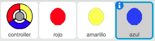
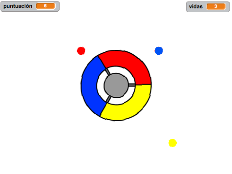

--- challenge ---
## Desafío: Más puntos 
Duplica el punto 'rojo' dos veces, y llama a los dos nuevos objetos 'amarillo' y 'azul'.

Edita estos objetos (incluido el código), para que el color de cada uno de los puntos tenga que coincidir con el color correcto del controlador. Recuerda probar el proyecto, y comprueba si consigues puntos y pierdes vidas cuando corresponde, ¡y que el juego no sea demasiado fácil ni difícil!

--- /challenge ---