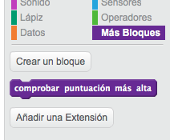
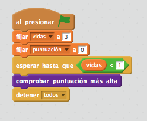

## Puntuación más alta

Vamos a guardar la puntuación más alta, para que los jugadores vean qué tal lo están haciendo.

+ Crea una nueva variable con el nombre `puntuación más alta`{:class="blockdata"}.

+ Haz clic en el escenario, y crea un nuevo bloque personalizado que se llame `comprobar puntuación más alta`{:class="blockmoreblocks"}.

	

+ Justo antes de que acabe el juego, añade tu nuevo bloque personalizado.

	

+ Añade código a tu bloque personalizado para guardar la `puntuación`{:class="blockdata"} actual como la `puntuación más alta`{:class="blockdata"} `si`{:class="blockcontrol"} es la máxima puntuación hasta el momento:

	```blocks
		definir [comprobar puntuación más alta]
		si <(puntuación) > (puntuación más alta)> entonces
   			fijar [puntuación más alta v] a (puntuación)
		fin
	```

+ Prueba el código que has añadido. Juega para comprobar si la `puntuación más alta`{:class="blockdata"} se actualiza correctamente.


