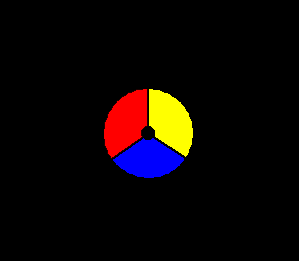
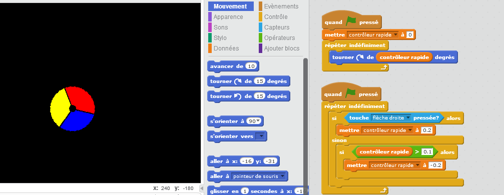

## Création d'un contrôleur

Commençons par créer un contrôleur qui sera utilisé pour rassembler des points.

+ Commencez un nouveau projet Scratch et supprimez le lutin de chat afin que votre projet soit vide. Vous pouvez trouver l'éditeur de Scratch en ligne à <a href="http://jumpto.cc/scratch-new">jumpto.cc/scratch-new</a>.

+ Pour ce projet, vous devriez avoir un dossier 'Ressources du projet', contenant l'image du contrôleur que vous pouvez utiliser. Assurez-vous de pouvoir trouver ce dossier et demandez à votre leader de club si vous ne le trouvez pas.

	

+ À partir du dossier des Ressources du projet, importez 'controller.png ' comme nouveau lutin. Si vous n'avez pas cette image, vous pouvez le dessiner vous-même! Vous devriez aussi mettre l'arrière-plan noir. Voici le résultat que vous devriez obtenir :

	

+ Vous pouvez déplacer votre contrôleur facilement, en le tournant à gauche ou à droite lorsque vous appuyez sur les flèches:

	```blocks
		quand le drapeau vert pressé
		répéter indéfiniment
			si <touche [flèche droite v] pressée?> alors
				tourner gauche de (2) degrés
			fin
		fin
	```
+ Testez votre contrôleur - il devrait tourner à gauche et à droite.

+ Même si ce code est fonctionnel, il serait plus intérressant de débuter le jeu à une grande vitesse et de la diminuer au fur et à mesure que le jeu avance. Pour ce faire, supprimez le code que vous avez créé pour votre contrôleur et créez une nouvelle variable appelée `vitesse contrôleur`{:class="blockdata"}.

+ Ajoutez ce code à votre contrôleur :

	```blocks
		quand le drapeau vert pressé
		ajouter [vitesse de contrôleur v] à [0]
		répéter indéfiniment
			tourner droite de (Vitesse de contrôleur) degrés
		end
	```

+ Pour le moment, ce code ne déplacera pas le contrôleur puisque la vitesse a été mise à 0! Créez un script séparé dans votre contrôleur, qui augmentera la vitesse lorsque la flèche sera appuyée.

	```blocks
		quand le drapeau vert pressé
		répéter indéfiniment
			si <touche [Flèche droite v] pressée?> alors
				ajouter à [Vitesse de contrôleur v] (0.2)
				sinon
			end
		end
	```

+ Avez-vous remarqué qu'il y a un écart dans le code ci-dessus ? Si la touche de direction n'est pas appuyée, vous devrez ajouter un code particulier pour ralentir le contrôleur. Cependant, vous devez seulement ralentir le contrôleur jusqu'à ce que la vitesse arrive à 0, autrement il commencera à tourner par en arrière.

	Voici le code que vous devriez ajouter :

	```blocks
	si <(Vitesse de contrôleur) > [0.1]> alors
		ajouter à [Vitesse de contrôleur v] (0.2)
	end
	```

	Voici comment votre code de contrôleur devrait être :

	

+ Testez votre projet à nouveau. Si vous maintenez la touche de direction droite, votre contrôleur devrait accélérer. Si vous lâchez la touche, votre contrôleur devrait ralentir progressivement.
