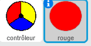
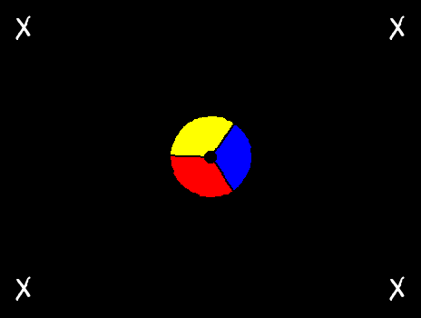
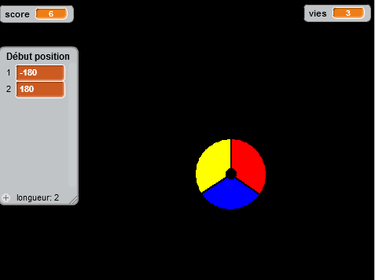
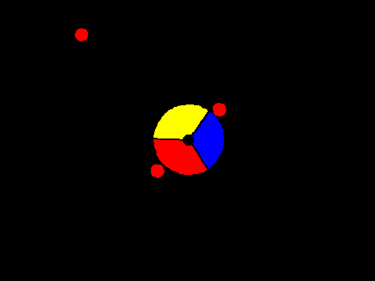

## Rassemblement de points

Ajoutons des points au jeu, que le joueur rassemblera avec son contrôleur.

+ Créez un nouveau lutin nommé 'rouge'. Ce lutin devrait être un petit point rouge.

	

+ Ajoutez ce script à votre lutin 'rouge', afin de créer un nouveau point dupliqué toutes les quelques secondes :

	```blocks
		quand le drapeau vert pressé
		cacher
		attendre (2) secondes
		répéter indéfiniment
   			créer un clone de [moi-même v]
   			attendre (nombre aléatoire entre (5) et (10)) secondes
		fin
	```

+ Lorsqu'un clone est créé, vous devez le faire apparaître dans l'un des quatre coins de l'étape. 

	

	Pour ce faire, créez d'abord une nouvelle liste appelée ` position début`{:class="blockdata"} et cliquez sur ` (+) ` pour ajouter les valeurs '-180' et '180'.

	

+ Vous pouvez utiliser ces 2 articles de liste afin de choisir un coin aléatoire dans l'étape. Ajoutez ce code au lutin 'pointé', pour que chaque nouveau clone se déplace vers un coin aléatoire et se déplace ensuite lentement vers le contrôleur.

	```blocks
		quand je commence comme un clone
		aller à x:(élément (random v) de [start positions v]) y:(élément (random v) de [start positions v])
		s'orienter vers [controller v]
		montrer
		répéter jusqu’à <[controller v] touché?>
  			avancer de (1)
		fin
	```

	Le code ci-dessus choisit '-180' ou '180' pour les positions x et le y. Ceci signifie que chaque clone commence dans un coin de l'étape.

+ Testez votre projet. Vous devriez voir que beaucoup de points rouges apparaissent dans chaque coin de l'écran et se déplacent lentement vers le contrôleur.

	

+ Créez 2 nouvelles variables appelées `vies`{:class="blockdata"} et `score`{:class="blockdata"}.

+ Ajoutez le code à votre étape pour établir les `vies`{:class="blockdata"} à 3 et le `score`{:class="blockdata"} à 0 au début du jeu.

+ Vous devez ajouter du code à la fin du code `quand je commence comme un clone`{:class="blockcontrol"} de votre point rouge, afin que 1 soit soit ajouté au `score`{:class="blockdata"} du joueur si la couleur correspond, ou que 1 soit retiré des `vies`{:class="blockdata"} du joueur si les couleurs ne correspondent pas.

	```blocks
		avancer de (5)
		si <couleur [#FF0000] touchée?> alors
   			ajouter à [score v] (1)
   			jouer le son [pop v]
		sinon
  			ajouter à [lives v] (-1)
   			jouer le son [laser1 v]
		fin
		supprimer ce clone
	```

+ Ajoutez ce code à la fin du script de votre étape pour que le jeu se termine lorsque le joueur perd toutes ses vies :

	```blocks
		attendre jusqu’à <(lives) < [1]>
		stop [tout v]
	```

+ Testez votre jeu pour vous assurer que ces codes fonctionnent.
