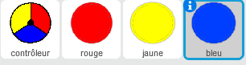
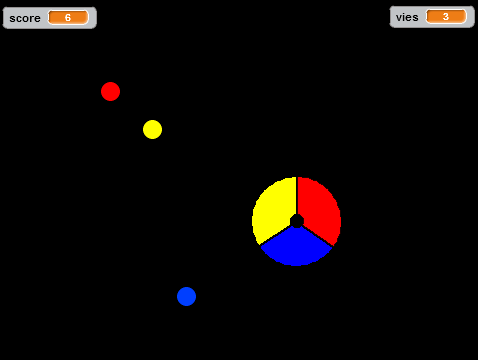

--- challenge ---
## Défi : Plus de points 
Dupliquez votre lutin pointé 'rouge' deux fois et nommez les deux nouveaux lutins 'jaune' et 'bleu'.

Éditez ces lutins (incluant leur code), afin que chaque point coloré corresponde à la couleur sur le contrôleur. Souvenez-vous de tester votre projet, en vous assurant que vous gagniez des points et que vous perdiez des vies aux bons moments et que votre jeu n'est pas trop facile ou trop difficile!

--- /challenge ---