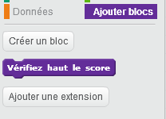
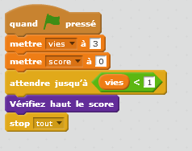

## Meilleur score

Sauvegardons le meilleur score afin que les joueurs puissent voir comment ils/elles se débrouillent.

+ Créez une nouvelle variable appelée `meilleur score`{:class="blockdata"}.

+ Cliquez sur votre étape et créez un nouveau bloc personnalisé appelé `contrôle meilleur score`{:class="blockmoreblocks"}.

	

+ Juste avant la fin du jeu, ajoutez votre nouveau bloc personnalisé.

	

+ Ajoutez le code à votre bloc personnalisé pour stocker le `score`{:class="blockdata"} actuel dans `meilleur score`{:class="blockdata"} `si`{:class="blockcontrol"} c'est le score le plus élevé jusqu'à maintenant :

	```blocks
		definir [vérifier en haut le score]
		si <(score) > (meilleur score)> alors
			ajouter [meilleur score v] à (score)
		end
	```

+ Testez le code que vous avez ajouté. Jouez votre jeu pour vérifier si `meilleur score`{:class="blockdata"} est mis à jour adéquatement.


