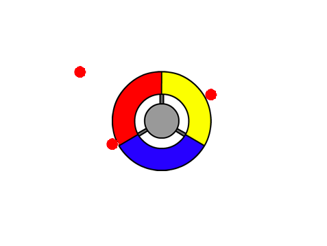

## बिंदु एकत्रित करना

चलिए खिलाड़ी के लिए अपने कंट्रोलर से एकत्रित करने के लिए कुछ बिंदु जोड़ते हैं।


+ 'लाल' नामक नई स्प्राइट बनाएं। यह स्प्राइट छोटा लाल बिंदु होनी चाहिए।

	

+ हर कुछ सेकंड में नया डॉट क्लोन बनाने के लिए, इस स्क्रिप्ट को अपने 'लाल' डॉट स्प्राइट में जोड़ें:

	```blocks
		जब ⚑ क्लिक किया गया हो
    छुपाएँ
    (2) सेकेंड तक ठहरे
    हमेशा के लिए 
      [myself v] का क्लोन बनाए
      ((5) से (10) तक क्रमरहित चुनने) सेकेंड तक ठहरे
    end
	```

+ जब प्रत्येक क्लोन बनाया जाता है, तो आप चाहते हैं कि यह स्टेज के 4 में से एक कोने में दिखाई दे।

	

	ऐसा करने के लिए, सबसे पहले `आरंभ स्थितियाँ`{:class="blockdata"} नामक नई __सूची__ बनाएँ और `-180` और `180` मान शामिल करने के लिए `(+)` पर क्लिक करें।

	

+ आप स्टेज के यादृच्छिक कोने के लिए सूची के इन 2 आइटमों का उपयोग कर सकते हैं। इस कोड को 'dot' स्प्राइट में जोड़ें, ताकि प्रत्येक नया क्लोन यादृच्छिक कोने में और फिर धीरे-धीरे कंट्रोलर की ओर गति करे।

	```blocks
		मेरे एक क्लोन के रूप में शुरू होने पर
		x:((random v) की [start positions v] चीज) y:((random v) की [start positions v] चीज) पर जाएँ
		[controller v] की तरफ देखे
		दिखाएं
		<[controller v] को छू रहा है?> तक दोहराते रहे
end
			(1) कदम चले
		end
	```

	x _और_ y के स्थानों के लिए उपर्युक्त कोड `-180` या `180` चुनता है, जिसका अर्थ है कि प्रत्येक क्लोन स्टेज के एक कोने में आरंभ होता है।

+ अपने प्रोजेक्ट का परीक्षण करें। आपको स्क्रीन के प्रत्येक कोने में कंट्रोलर की ओर धीरे-धीरे बढ़ते कई लाल बिंदु दिखाई देंगे।

	

+ `जीवन`{:class="blockdata"} और `स्कोर`{:class="blockdata"} नामक 2 नए वेरिएबल्स बनाएँ।

+ गेम के आरंभ में `जीवन`{:class="blockdata"} को 3 और `स्कोर`{:class="blockdata"} को 0 सेट करने के लिए अपने स्टेज में कोड जोड़ें।

+ आपको अपने लाल बिंदु के `मेरे एक क्लोन के रूप में शुरू होने पर`{:class="blockcontrol"} के अंत में कोड जोड़ना चाहिए, ताकि रंग मिलने पर खिलाड़ी के `स्कोर`{:class="blockdata"} में 1 जुड़ जाए, या रंग न मिलने की स्थिति में खिलाड़ी की `जीवन`{:class="blockdata"} में से 1 कम हो जाए।

	```blocks
		(5) कदम चले
    अगर <[#FF0000] रंग को छू रहा है?> हो तो 
      [score v] से (1) बदले
      [pop v] ध्वनि बजाएँ

      [lives v] से (-1) बदले
      [laser1 v] ध्वनि बजाएँ
    end
    इस क्लोन को डिलिट करें
	```

+ इस कोड को अपने स्टेज की स्क्रिप्ट के अंत में जोड़ें, ताकि जब खिलाड़ी अपने सभी जीवन खो देता है, तो गेम समाप्त हो जाए:

	```blocks
		<(lives) < [1]> होने तक ठहरे
		रोक दे [सब v]
	```

+ कोड का अपेक्षा के अनुसार कार्य करना सुनिश्चित करने के लिए, अपनी गेम का परीक्षण करें।


