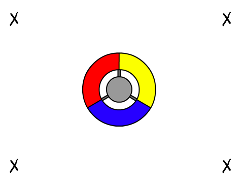

## Raccogli puntini

Aggiungiamo dei puntini che il giocatore dovrà raccogliere con il suo controller.

+ Crea un nuovo sprite chiamato 'rosso'. Questo sprite dovrebbe essere un puntino rosso.

	

+ Aggiungi questa scritta al tuo puntino 'rosso', per creare un nuovo clone di puntino ogni alcuni secondi:

	```blocks
		quando si clicca sulla bandiera verde
		nascondi
		attendi (2) secondi
		per sempre
 			crea clone di [me stesso v]
  			attendi (numero a caso tra (5) e (10)) secondi
		end
	```

+ Quando è stato creato ciascun clone, vuoi che appaiano in uno dei 4 angoli del quadro.

	

	Per fare ciò, crea prima una nuova __lista__ chiamata `posizioni iniziali`{:class="blockdata"} e clicca il `(+)` per aggiungere i valori `-180` e `180`.

	

+ Puoi usare questi 2 oggetti in lista per scegliere un angolo a caso del quadro. Aggiungi questo codice allo sprite 'puntino' così che ogni clone nuovo si muova verso un angolo a caso e poi lentamente verso il controller.

	```blocks
		quando vengo clonato
		vai a x: (elemento (a caso v) di [posizione iniziale v] :: list) y: (elemento (a caso v) di [posizione iniziale v] :: list)
		punta verso [controller v]
		mostra
		ripeti fino a quando <sta toccando [controller v]>
  			fai (1) passi
		end
	```

	Il codice di cui sopra sceglie `-180` o `180` per le posizioni x _e_ y, il che significa che ogni clone inizia in un angolo del quadro.

+ Metti alla prova il tuo progetto. Dovresti vedere apparire tanti puntini rossi in ogni angolo dello schermo, e muoversi lentamente verso il controller.

	

+ Crea 2 nuove variabili chiamate `vite`{:class="blockdata"} e `punteggio`{:class="blockdata"}.

+ Aggiungi un codice al tuo quadro per impostare le `vite`{:class="blockdata"} a 3 e il `punteggio`{:class="blockdata"} a 0 all'inizio della partita.

+ Dovrai aggiungere un codice alla fine del tuo codice `quando vengo clonato`{:class="blockcontrol"} dei puntini rossi, così che 1 viene aggiunto al `punteggio`{:class="blockdata"} del giocatore se i colori corrispondono, o 1 viene detratto dalle `vite`{:class="blockdata"} del giocatore se i colori non corrispondono.

	```blocks
		fai (5) passi
		se <sta toccando il colore [#FF0000]> allora
   			cambia [vite v] di (1)
   			produci suono [pop v]
		altrimenti
   			cambia [punteggio v] di (-1)
   			produci suono [laser1 v]
		end
		elimina questo clone
	```

+ Aggiungi questo codice alla fine del testo del tuo quadro, in modo che la partita finisca quando il giocatore perde tutte le vite:

	```blocks
		attendi fino a quando <(vite) < [1]>
		ferma [tutto v]
	```

+ Prova il tuo gioco per controllare che questo codice funzioni come previsto.


