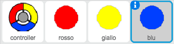

--- challenge ---
## Sfida: Altri puntini 
Duplica il tuo sprite di puntino 'rosso' due volte, e nomina i due nuovi sprite 'giallo' e 'blu'.

Modifica questi sprite (incluso il loro codice) in modo che ogni puntino colorato debba corrispondere con il colore giusto sul controller. Ricordati di provare il tuo progetto, assicurandoti di guadagnare punti e prdere vite nei momenti giusti, e che il tuo gioco non sia troppo facile né troppo difficile!

--- /challenge ---