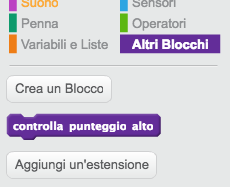
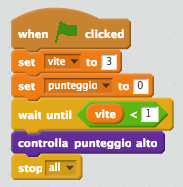

## Punteggio alto

Salviamo il punteggio alto, in modo che i giocatori possano vedere come stanno andando.

+ Crea una nuova variabile chiamata `punteggio alto`{:class="blockdata"}.

+ Clicca sul tuo quadro, e crea un nuovo blocco personalizzato chiamato `controlla punteggio alto`{:class="blockmoreblocks"}.

	

+ Appena prima che la partita finisca, aggiungi il tuo nuovo blocco personalizzato.

	

+ Aggiungi un codice al tuo blocco personalizzato per salvare il `punteggio`{:class="blockdata"} attuale come `punteggio alto`{:class="blockdata"} `se`{:class="blockcontrol"} è il punteggio più alto fino ad ora.

	```blocks
		definisci (controlla punteggio alto)
		se <(punteggio) > (punteggio alto)> allora
  			porta [punteggio alto v] a (punteggio)
		end
	```

+ Prova il codice che hai aggiunto. Gioca la tua partita per controllare se il `punteggio alto`{:class="blockdata"} si è aggiornato correttamente.


