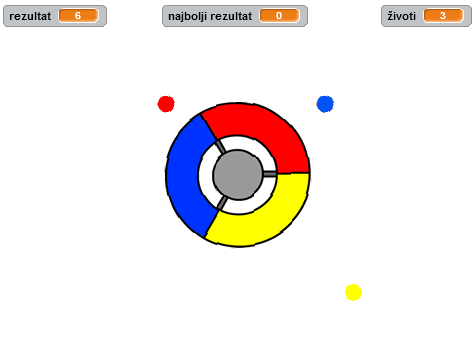

--- no-print ---

This is the **Scratch 2** version of the project. There is also a [Scratch 3 version of the project](https://projects.raspberrypi.org/me-ME/projects/catch-the-dots).

--- /no-print ---

## Uvod

U ovom projektu naučićeš kako da napraviš igru u kojoj treba da spojiš obojene tačke sa odgovarajućim dijelom kontrolera.

  <iframe allowtransparency="true" width="485" height="402" src="https://scratch.mit.edu/projects/embed/240006065/?autostart=false" frameborder="0"></iframe>
  

### Dodatne informacije za vođe kluba

Ukoliko je potrebno da odštampate ovaj projekat, koristite [Verziju za štampu](https://projects.raspberrypi.org/me-ME/projects/catch-the-dots-scratch2/print).

--- collapse ---
---
title: Bilješke za vođe kluba
---
## Uvod:

U ovom projektu djeca će naučiti kako da naprave igru u kojoj igrač treba da spoji obojene tačke sa odgovarajućim dijelom kontrolera.

## Izvori

Za ovaj projekat koristite Scratch 2. Scratch 2 možete koristiti online na [jumpto.cc/scratch-on](http://jumpto.cc/scratch-on) ili ga preuzeti sa [jumpto.cc/scratch-off](http://jumpto.cc/scratch-off) i koristiti offline.

Link 'Project Materials' za ovaj projekat sadrži sljedeće izvore:

##### Izvori za vođe kluba

Završenu verziju projekta možete naći [online](http://scratch.mit.edu/projects/240006065/#editor) ili preuzeti klikom na link 'Project Materials', koji sadrži:

* CatchTheDots.sb2

##### Izvori projekta

Za ovaj projekat, članovi kluba mogu da koriste spoljašnje izvore koji nisu dostupni u Scratch biblioteci:

* controller.svg.

Obezbijedite da svako dijete ima pristup kopiji ovih izvora.

Za članove kluba koji nisu u mogućnosti da pristupe ovim izvorima projekta, postoji Scratch projekat u kojem su spoljašnji izvori već učitani. Projekat je dostupan online na [scratch.mit.edu/projects/240006242/#editor](https://scratch.mit.edu/projects/240006242/#editor) ili u projektnim materijalima koji se mogu preuzeti. Materijali sadrže:

* CatchTheDotsResources.sb2 

## Ciljevi učenja

* U ovom projektu utvrđuju se prethodno savladane vještine programiranja.

Ovim projektom obuhvaćeni su elementi iz sljedećih dijelova [Raspberry Pi Digital Making Curriculum](http://rpf.io/curriculum):

* [Kombinujte programske konstrukcije za rješavanje problema.](https://www.raspberrypi.org/curriculum/programming/builder)

## Izazovi

* "Okretanje ulijevo" - kreiranje kôda za pomjeranje kontrolera;
* "Više tačaka" - kreiranje više obojenih tačaka koje treba da se usklade sa odgovarajućim dijelom kontrolera;
* "Tačke koje se brže kreću" - korišćenje promjenljive za povećanje brzine tačaka tokom igre;
* "Poboljšaj svoju igru!" - dodavanje novih tačaka koristeći promjenljive `rezultat`{:class="blockdata"}, `razmak`{:class="blockdata"} i `brzina`{:class="blockdata"};
* "Meni igre" - izrada menija sa različitim pozadinama pozornice i dugmadima za kretanje između njih.

--- /collapse ---

--- collapse ---
---
title: Projektni materijali
---
## Izvori projekta

* [Online Scratch 2 projekat koji sadrži spoljašnje izvore](http://scratch.mit.edu/projects/240006242/#editor)
* [Scratch 2 projekat koji sadrži spoljašnje izvore i koji se može preuzeti](resources/CatchTheDotsResources.sb2)
* [controller.svg](resources/controller.svg)

## Izvori za vođe kluba

* [Završen Scratch 2 projekat koji se može preuzeti](resources/CatchTheDots.sb2)
* [Završen Scratch 2 projekat online](http://scratch.mit.edu/projects/240006065/#editor)

--- /collapse ---