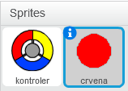
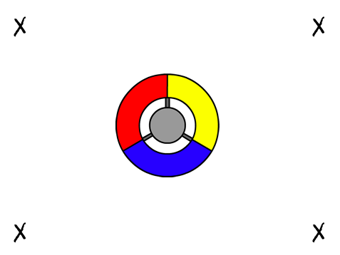
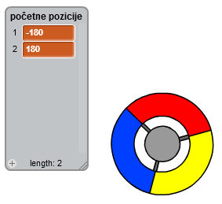
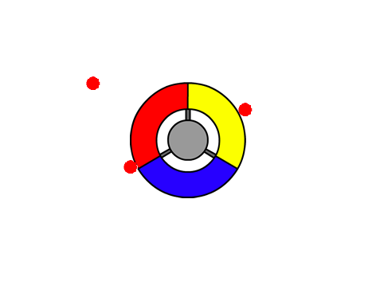

## Sakupljanje tačaka

Dodajmo nekoliko tačaka koje igrač treba da sakupi svojim kontrolerom.

+ Kreiraj novi lik (sprite) pod nazivom 'crvena'. Ovaj lik bi trebalo da bude mala crvena tačka.
    
    

+ Dodaj sljedeću skriptu svom liku 'crvene' tačke kako bi se kreirao novi klon tačke svakih nekoliko sekundi:
    
    ```blocks
        when flag clicked
        hide
        wait (2) secs
        forever
            create clone of [myself v]
            wait (pick random (5) to (10)) secs
        end
    ```

+ Kada se kreira novi klon, želimo da se pojavi u jednom od 4 ugla pozornice.
    
    
    
    Da to uradiš, prvo napravi novu **listu** (list) i nazovi je `početne pozicije`, a zatim klikni na `+` da dodaš vrijednosti `-180` i `180`.
    
    

+ Ova 2 elementa liste možeš da koristiš za odabiranje nasumičnog ugla pozornice. Dodaj liku 'tačke' sljedeći kôd, tako da se svaki novi klon pojavi u nasumičnom uglu, a zatim da se polako kreće prema kontroleru.
    
    ```blocks
        when I start as a clone
        go to x: (item (random v) of [početne pozicije v]) y: (item (random v) of [početne pozicije v])
        point towards [controller v]
        show
        repeat until <touching [controller v]?>
            move (1) steps
        end
    ```
    
    Ovaj kôd bira `-180` ili `180` za x *i* y pozicije, što znači da će svaki klon krenuti iz jednog ugla pozornice.

+ Isprobaj svoj projekat. Trebalo bi da vidiš puno crvenih tačaka koje se pojavljuju u svim uglovima ekrana i polako se kreću prema kontroleru.
    
    

+ Napravi 2 nove promjenljive (variables) i daj im nazive `životi`{:class="blockdata"} i `rezultat`{:class="blockdata"}.

+ Svojoj pozornici dodaj kôd kojim ćeš na početku igre postaviti `živote`{:class="blockdata"} na 3 i `rezultat`{:class="blockdata"} na 0.

+ Na kraj kôda crvene tačke `when I start as a clone`{:class="blockcontrol"} (kada krećem kao klon) treba da dodaš kôd kojim ćeš igračevom `rezultatu`{:class="blockdata"} dodati 1 ako se boje poklapaju ili od `života` igrača oduzeti 1 ako se boje ne poklapaju.
    
    ```blocks
        move (5) steps
        if <touching color [#FF0000]?> then
            change [rezultat v] by (1)
            play sound [pop v]
        else
            change [životi v] by (-1)
            play sound [laser1 v]
        end
        delete this clone
    ```

+ Na kraj skripte pozornice dodaj ovaj kôd, tako da se igra završi kada igrač izgubi sve živote:
    
    ```blocks
        wait until <(životi) < [1]>
        stop [all v]
    ```

+ Isprobaj svoju igru da provjeriš da li ovaj kôd funkcioniše kako treba.