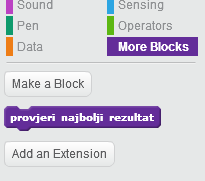
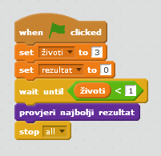

## Najbolji rezultat

Sačuvajmo najbolji rezultat da bi igrači mogli da vide kako im ide.

+ Kreiraj novu promjenljivu i nazovi je `najbolji rezultat`{:class="blockdata"}.

+ Klikni na pozornicu i napravi sopstveni novi blok pod nazivom `provjeri najbolji rezultat`{:class="blockmoreblocks"}.
    
    

+ Dodaj svoj novi blok prije završetka igre.
    
    

+ Svom bloku dodaj kôd da trenutni `rezultat`{:class="blockdata"} bude sačuvan kao `najbolji rezultat`{:class="blockdata"} `ako je`{:class="blockcontrol"} to do tada najbolji rezultat:
    
    ```blocks
        define [provjeri najbolji rezultat]
        if <(rezultat) > (najbolji rezultat)> then
            set [najbolji rezultat v] to (rezultat)
        end
    ```

+ Isprobaj dodati kôd. Odigraj igru da provjeriš da li se `najbolji rezultat`{:class="blockdata"} mijenja kako bi trebalo.