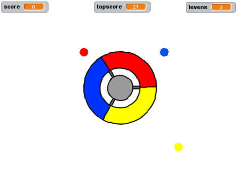

--- no-print ---

This is the **Scratch 2** version of the project. There is also a [Scratch 3 version of the project](https://projects.raspberrypi.org/nl-NL/projects/catch-the-dots).

--- /no-print ---

## Inleiding

In dit project leer je hoe je een spel maakt waarbij je gekleurde stippen moet vangen met het goede deel van de controller.

  <iframe allowtransparency="true" width="485" height="402" src="//scratch.mit.edu/projects/embed/217359859/?autostart=false" frameborder="0"></iframe>
  

### Aanvullende informatie voor clubleiders

Als je dit project wilt afdrukken, gebruik dan de [ printvriendelijke versie ](https://projects.raspberrypi.org/nl-NL/projects/catch-the-dots-scratch2/print).

--- collapse ---
---
title: Clubleider notities
---

## Inleiding:

In dit project leren kinderen een spel te maken waarbij de speler gekleurde stippen moet vangen met het overeenkomstige deel van de controller.

## Bronnen

Voor dit project moet Scratch 2 worden gebruikt. Scratch 2 kan online worden gebruikt op [jumpto.cc/scratch-on](http://jumpto.cc/scratch-on) of worden gedownload van [jumpto.cc/scratchoff](http://jumpto.cc/scratch-off) en offline worden gebruikt.

De link 'Projectmaterialen' voor dit project bevat de volgende bronnen:

##### Clubleider bronnen

Je kunt een voltooide versie van dit project [online](https://scratch.mit.edu/projects/217359859/) vinden of het kan worden gedownload door op de link 'Projectmaterialen' te klikken voor dit project, dat het volgende bevat:

* CatchTheDots.sb2

##### Projectbronnen

Voor dit project kunnen clubleden gebruik maken van externe bronnen die niet beschikbaar zijn in de Scratch-bibliotheek:

* controller.svg.

Zorg ervoor dat elk kind toegang heeft tot een kopie van deze bronnen.

Voor clubleden die geen toegang hebben tot deze projectbronnen, is er een Scratch-project met de externe bronnen vooraf geladen. Dit is online beschikbaar op [jumpto.cc/dots-resources](http://jumpto.cc/dots-resources) of in het downloadbare projectmateriaal, dat het volgende bevat:

* CatchTheDotsResources.sb2 

## Leerdoelen

* Dit project bestendigt het leren van eerdere geleerde programmeervaardigheden.

Dit project behandelt elementen uit de volgende onderdelen van het [Raspberry Pi Digital Making Curriculum](http://rpf.io/curriculum):

* [Combineer programmeerconstructies om een ​​probleem op te lossen.](https://www.raspberrypi.org/curriculum/programming/builder)

## Uitdagingen

* "Naar links draaien" - code maken om de controller te verplaatsen;
* "Meer stippen" - meer gekleurde stippen maken die overeenkomen met het juiste deel van de controller ';
* "Sneller bewegende stippen" - gebruik een variabele om de snelheid van de stippen gedurende het spel te verhogen;
* "Verbeter je spel!" - het toevoegen van nieuwe stippen die de `score`{:class="blockdata"}, `vertraging`{:class="blockdata"} en `snelheid`{:class="blockdata"} variabelen manipuleren;
* "Spelmenu" - een menu maken met verschillende achtergronden en knoppen om daartussen te bewegen.

--- /collapse ---

--- collapse ---
---
title: Projectmaterialen
---

## Projectbronnen

* [Online Scratch 2-project met externe bronnen](http://jumpto.cc/dots-resources)
* [Downloadbaar Scratch 2-project met externe bronnen](resources/CatchTheDotsResources.sb2)
* [controller.svg](resources/controller.svg)

## Clubleider middelen

* [Downloadbaar voltooid Scratch 2-project](resources/CatchTheDots.sb2)
* [Online voltooid Scratch 2-project](https://scratch.mit.edu/projects/217359859/)

--- /collapse ---