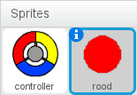
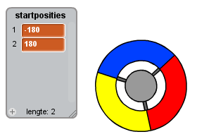

## Stippen verzamelen

We gaan een paar stippen toevoegen die de speler met zijn controller kan verzamelen.

+ Maak een nieuwe sprite met de naam 'rood'. Deze sprite zou een kleine rode stip moeten zijn.
    
    

+ Voeg dit script toe aan de 'rode' stip-sprite, om elke paar seconden een nieuwe stipkloon te maken:
    
```blocks
wanneer groene vlag wordt aangeklikt
verdwijn
wacht (2) sec.
herhaal 
  maak kloon van [mijzelf v]
  wacht (willekeurig getal tussen (5) en (10)) sec.
end
```

+ Als elke kloon is gemaakt, wil je dat die tevoorschijn komt in een van de vier hoeken van het speelveld.
    
    
    
    Maak hiervoor eerst een nieuwe **lijst** met de naam `startposities`{:class="blockdata"} en klik op `(+)` om de waarden `-180` en `180` toe te voegen.
    
    

+ Je kunt deze 2 lijstitems gebruiken om een ​​willekeurige hoek van het speelveld te kiezen. Voeg deze code toe aan de 'stip' sprite, zodat elke nieuwe kloon naar een willekeurige hoek gaat en dan langzaam naar de controller toe beweegt.
    
```blocks
wanneer ik als kloon start
ga naar x: (item (willekeurig v) van [startposities v] :: list) y: (item (willekeurig v) van [startposities v] :: list)
richt naar [controller v]
verschijn
herhaal tot <touching [controller v]?> 
  neem (1) stappen
end
```

De code hierboven kiest `-180` of `180` voor de posities x *en* y, wat betekent dat elke kloon in een hoek van het speelveld begint.

+ Test je project. Je zou in elke hoek van het scherm veel rode stippen moeten zien verschijnen die langzaam naar de controller bewegen.
    
    

+ Maak 2 nieuwe variabelen met de naam `levens`{:class="blockdata"} en `score`{:class="blockdata"}.

+ Voeg code toe aan speelveld om `levens`{:class="blockdata"} op 3 en `score`{:class="blockdata"} op 0 te zetten aan het begin van het spel.

+ Er moet code worden toegevoegd aan het einde van blok `wanneer ik als kloon start
`{:class="blockcontrol"}, zodat 1 wordt toegevoegd aan de `score`{:class="blockdata"} van de speler als de kleuren overeenkomen, of 1 van `levens`{:class="blockdata"} eraf gaat als de kleuren niet overeenkomen.
    
```blocks
neem (5) stappen
als <touching color [#FF0000]?> dan 
  verander [score v] met (1)
  start geluid [pop v]

  verander [lives v] met (-1)
  start geluid [laser1 v]
end
verwijder deze kloon
```

+ Voeg deze code toe aan het einde van het script van het speelveld zodat het spel eindigt als de speler al zijn levens verloren heeft:
    
```blocks
wacht tot <(levens) < [1]>
stop [alle v]
```

+ Test je spel om te controleren of deze code werkt zoals verwacht.