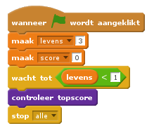

## Topscore

We gaan de topscore opslaan, zodat spelers kunnen zien hoe goed ze het doen.

+ Maak een nieuwe variabele met de naam `topscore`{:class="blockdata"}.

+ Klik op het speelveld en maak een nieuw aangepast blok genaamd `controleer topscore`{:class="blockmoreblocks"}.
    
    

+ Voeg net voor het einde van het spel het nieuwe aangepaste blok toe.
    
    

+ Voeg code toe aan het aangepaste blok om de huidige `score`{:class="blockdata"} op te slaan als de `topscore`{:class="blockdata"} `als`{:class="blockcontrol"} het de hoogste score tot nu toe is:
    
```blocks
definieer (controleer topscore)
als <(score) > (topscore)> dan 
  maak [topscore v] (score)
end
```

+ Test de code die je hebt toegevoegd. Speel het spel om te controleren of de `topscore`{:class="blockdata"} correct wordt bijgewerkt.